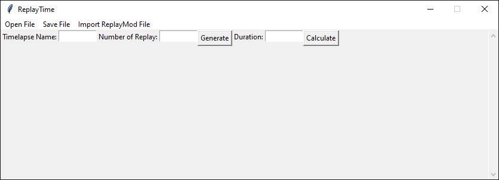
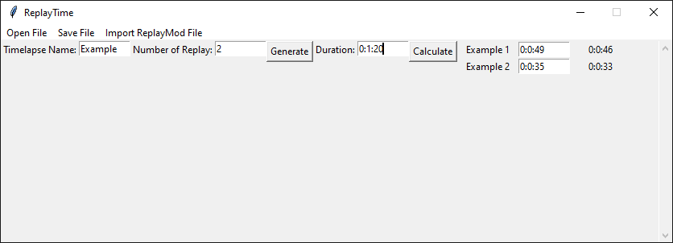
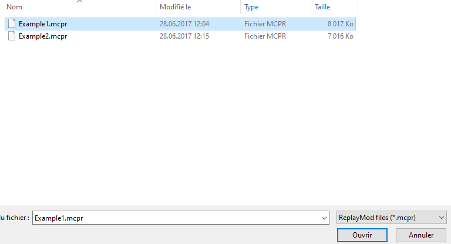

# ReplayTime
A program to facilitate timelapse creation.
 
## Interface
Duration is the duration of the timelapse
Timelapse Name: Name of the timelapse project
Generate: Gererate the table for set the duration of each replay
Duration: Duration of all the timelapse
Calculate: Calculate duration to each replay to respect the total duration

## Import Replay File
Number your files from 1 to x. The number always goes at the end.
**Always import the file number 1, the programm will take the others.**

